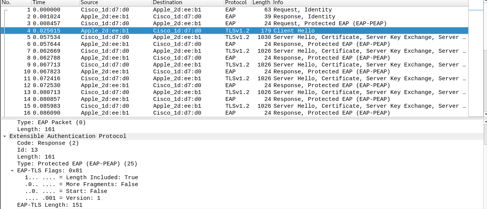

# Sécurité des réseaux sans fil

## Laboratoire 802.11 Sécurité WPA Entreprise

Romain Silvestri & Romain Gallay

### 1. Capture et analyse d’une authentification WPA Entreprise

- Comparer votre capture au processus d’authentification expliqué en classe (n’oubliez pas les captures !). En particulier, identifier les étapes suivantes :
	- Requête et réponse d’authentification système ouvert

	
	

 	- Requête et réponse d’association

 	

	

	- Sélection de la méthode d’authentification **_La méthode d'authentification est EAP-PEAP comme on peut l'observer sur le screen ci-dessus_**

	- Phase d’initiation. Arrivez-vous à voir l’identité du client ?
	**_Oui, on observe dans la réponse d'authentification que l'identité correspond ici à abraham.rubinste_**
	- Phase hello :
		- Version TLS
		**_La version TLS utilisée est la 1.2_**

		

		- Suites cryptographiques et méthodes de compression proposées par le client et acceptées par l’AP

		**_On observe tout d'abord les suites cryptographiques proposées par le client et on note qu'aucune méthode de compression n'est proposée:_**

		

		**_La suite cryptographiques acceptées par l'AP est TLS_ECDHE_RSA_WITH_AES_256_GCM_SHA384:_**

		

		- Nonces
		**_Le nonce correspond au champ random dans les packets:_**

		
		

		- Session ID
		**_Comme on peut l'observer sur le screen ci-dessus, la session ID du server correspond à cfd09ac... Celle du client à une longeur de 0, elle n'est donc pas définie_**

	- Phase de transmission de certificats
	 	- Certificat serveur

		

		- Change cipher spec

		

	- Authentification interne et transmission de la clé WPA (échange chiffré, vu comme « Application data »)

	

	- 4-way hadshake

	**_Il s'effectue à la fin et n'est pas visible dans la capture_**

### Répondez aux questions suivantes :
 
> **_Question :_** Quelle ou quelles méthode(s) d’authentification est/sont proposé(s) au client ?
> 
> **_Réponse :_** Seule EAP-PEAP est proposée.

---

> **_Question:_** Quelle méthode d’authentification est utilisée ?
> 
> **_Réponse :_** EAP-PEAP

---

> **_Question:_** Lors de l’échange de certificats entre le serveur d’authentification et le client :
> 
> - Le serveur envoie-t-il un certificat au client ? Pourquoi oui ou non ?
> 
> **_Réponse:_** Oui, le serveur envoie au client un certificat afin que celui-ci puisse l'identifier.
> 
> - Le client envoie-t-il un certificat au serveur ? Pourquoi oui ou non ?
> 
> **_Réponse:_** Non. Le client n'envoie pas de certificat au serveur. L'authentification de celui-ci s'effectue donc plus tard
	   en interne.
> 

---

### 2. Attaque WPA Entreprise

### Répondez aux questions suivantes :

> **_Question :_** Quelles modifications sont nécessaires dans la configuration de hostapd-wpe pour cette attaque ?
> 
> **_Réponse :_** 
Nous avons dû modifier l'interface et le nom du SSID.
  
  

---

> **_Question:_** Quel type de hash doit-on indiquer à john pour craquer le handshake ?
> 
> **_Réponse:_** 
Pour craquer le mot de passe, nous avons plutôt utilisé l'outil *asleap* qui est spécialement concu pour ce genre d'attaque.  
Il faut lui donner en paramètres: un dictionnaire (ici nous avons utilisé *rockyou* qui est disponible par défaut sur kali), le *challenge* et la *response*.  
  
En quelque seconde, on trouve le mot de passe qui a été utilisé pour se connecter.

---

> **_Question:_** 6.	Quelles méthodes d’authentification sont supportées par hostapd-wpe ?
> 
> **_Réponse:_**
> Les informations ci-dessous proviennent de la documentation de hostapd-wpe qui est disponible [ici](https://tools.kali.org/wireless-attacks/hostapd-wpe).
> 1. EAP-FAST/MSCHAPv2 (Phase 0)
> 2. PEAP/MSCHAPv2
> 3. EAP-TTLS/MSCHAPv2
> 4. EAP-TTLS/MSCHAP
> 5. EAP-TTLS/CHAP
> 6. EAP-TTLS/PAP